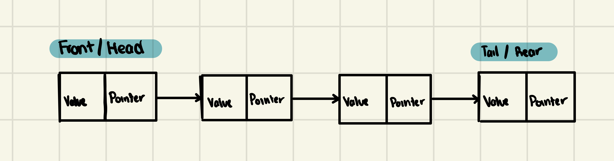

# Queue

Queue is a linear data structure which follows a particular order in which the operations are performed. The order is First In First Out (FIFO). A good example of a queue is any queue of consumers for a resource where the consumer that came first is served first. The difference between stacks and queues is in removing. In a stack we remove the item the most recently added; in a queue, we remove the item the least recently added.

The elements are added at the end of the queue and removed from the front of the queue. This makes queue a First In First Out (FIFO) data structure. The elements in a queue are linked in the following way:

## Advantages

- Easy to implement
- Can be used in many situations where we need to keep track of the order in which things are added

## Disadvantages

- No random access
- No peeking

## Applications

- Breadth First Search
- CPU Scheduling
- Disk Scheduling
- Memory Management
- Network Packet Routing
- Printing
- Process Scheduling
- Web Server Request Handling

## Operations

- Enqueue
- Dequeue
- Peek
- IsEmpty
- IsFull

## Complexity

| Operation | Complexity |
| --------- | ---------- |
| Enqueue   | O(1)       |
| Dequeue   | O(1)       |
| Peek      | O(1)       |
| IsEmpty   | O(1)       |
| IsFull    | O(1)       |

## References

- [Wikipedia](<https://en.wikipedia.org/wiki/Queue_(abstract_data_type)>)
- [GeeksforGeeks](https://www.geeksforgeeks.org/queue-data-structure/)
- [TutorialsPoint](https://www.tutorialspoint.com/data_structures_algorithms/queue_data_structure.htm)
- [Programiz](https://www.programiz.com/dsa/queue)
