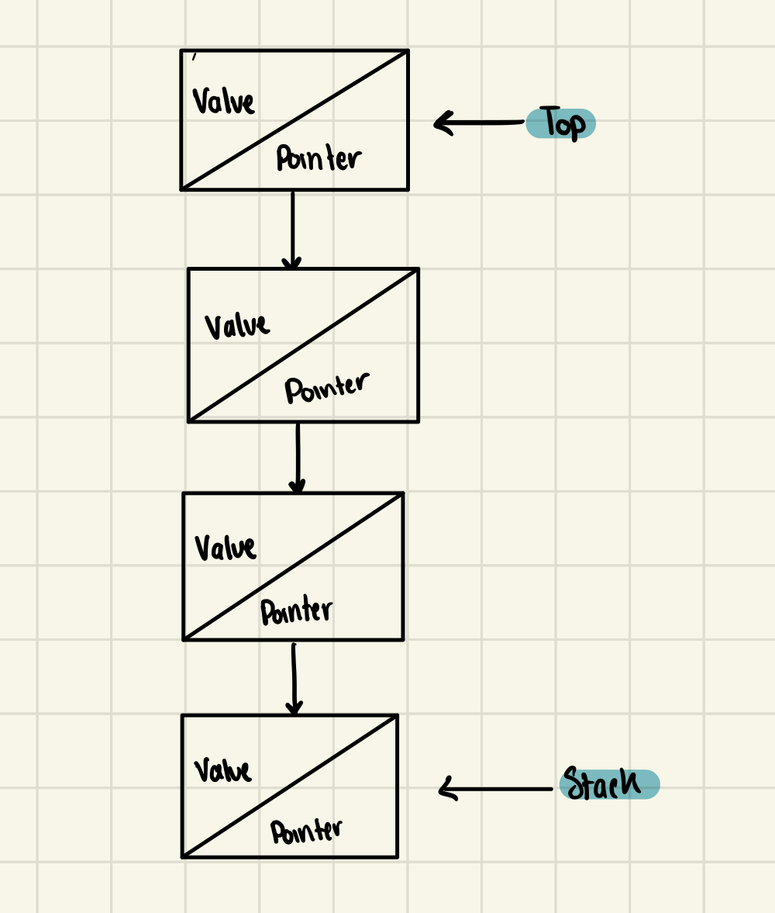

# Stack

Stack is a linear data structure which follows a particular order in which the operations are performed. The order may be LIFO(Last In First Out) or FILO(First In Last Out). A good example of stack is any pile of objects where you take the object from the top of the pile. The difference between stacks and queues is in removing. In a stack we remove the item the most recently added; in a queue, we remove the item the least recently added.

Stack elements are added and removed from the same end. This end is called the top of the stack. The opposite end is called the base of the stack. The elements in a stack are linked in the following way:

## Advantages

- Easy to implement
- Easy to remember
- Can be used in many situations where we need to keep track of the order in which things are added

## Disadvantages

- No random access
- No peeking

## Applications

- Backtracking
- Depth First Search
- Function Call Stacks
- Infix to Postfix Conversion
- Infix to Prefix Conversion
- Postfix to Infix Conversion
- Prefix to Infix Conversion
- Tower of Hanoi
- Undo Mechanism
- Web Browsers

## Operations

- Push
- Pop
- Peek
- IsEmpty
- IsFull

## Complexity

| Operation | Complexity |
| --------- | ---------- |
| Push      | O(1)       |
| Pop       | O(1)       |
| Peek      | O(1)       |
| IsEmpty   | O(1)       |
| IsFull    | O(1)       |

## References

- [Wikipedia](<https://en.wikipedia.org/wiki/Stack_(abstract_data_type)>)
- [GeeksforGeeks](https://www.geeksforgeeks.org/stack-data-structure/)
- [TutorialsPoint](https://www.tutorialspoint.com/data_structures_algorithms/stack_data_structure.htm)
